<div align="center">

# Git Tutorial for OSC


##### A small tutorial for git that was prepared for an event for OSC - BZU

</div>

## Goals of this tutorial

1. Understand the basics of *git*
2. Create a local git repository using the command line
3. *Push* local git repository to github


## Important Git Commands
```
git init
git status
git add <file name> 
git commit -m "your message"
git push -u <remote name> <branch name>
```


### Step #1: Installing Git

Download git from the official website [Git](https://git-scm.com/). 


### Step #2: Create directory for tutorial
```
mkdir git-tutorial
cd git-tutorial
```


### Step #3: Initialize git repository
```
git init
```

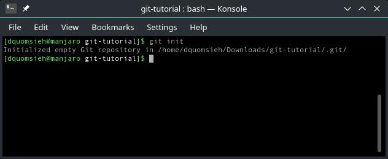


### Step #4: Check status of empty git repository
```
git status
```

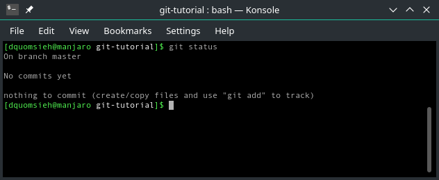

### Step #5: Create empty file
```
touch file.txt
ls
```

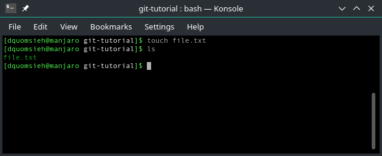


### Step #6: Check status of repository when a file is added
```
git status
```

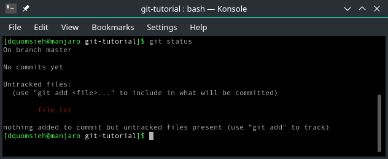

### Step #7: Add file to staging
```
git add file.txt
```

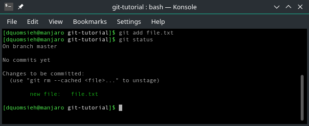


### Step #8: Configure email and user name
```
git config --global user.email "YourEmail@gmail.com"
git config --global user.name "Your Name"
```

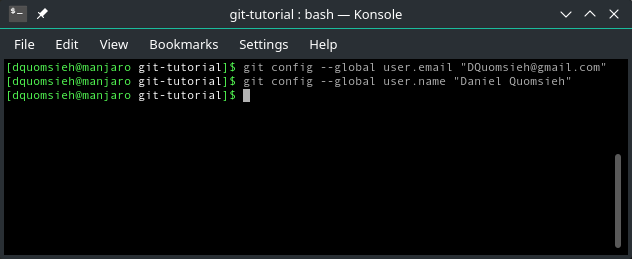

### Step #9 Make a commit
```
git commit -m "my first commit!"
```

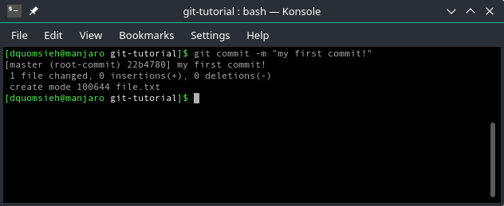


### Step #10: Check git log
```
git log
```

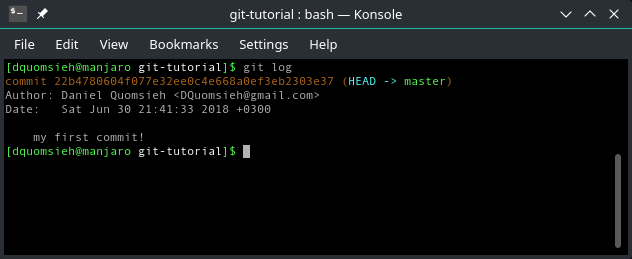

### Step #11: Make github account and repository

Create an account on Github
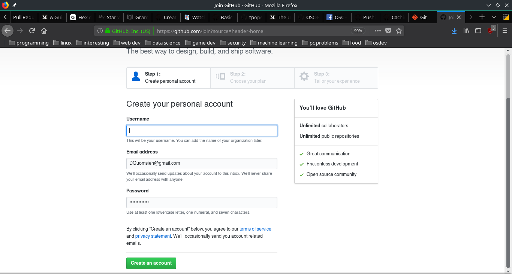

Then create a repository by clicking on the top right "+" then "new repository".

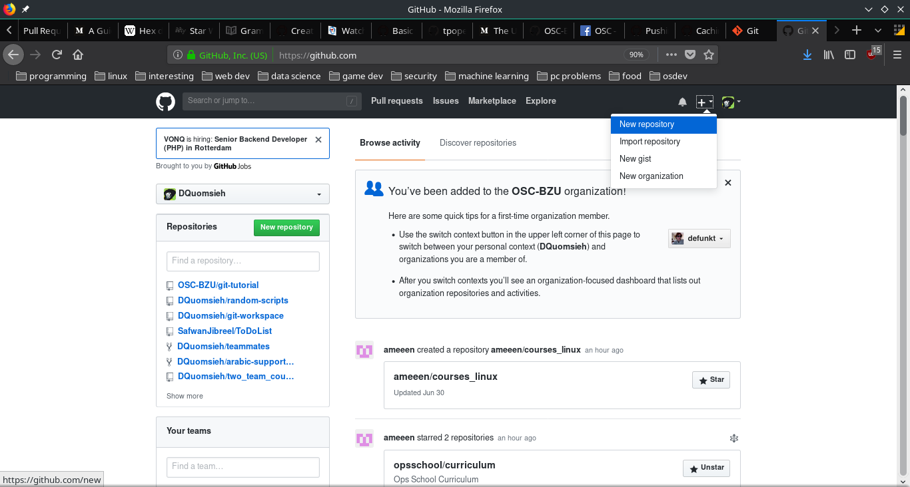

After that give it a name 

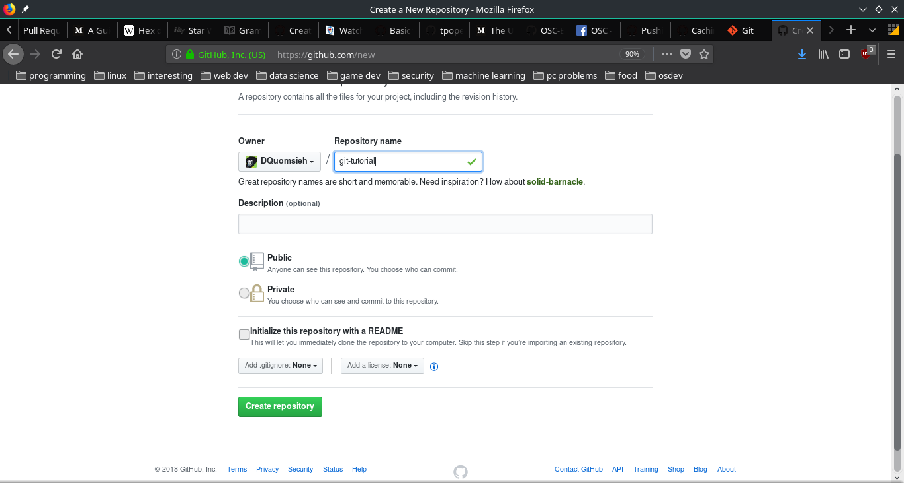

### Step #12: Add remote url to local git repository
```
git remote add origin <link to repo>
```

first we have to copy the url of the repository we just made on github

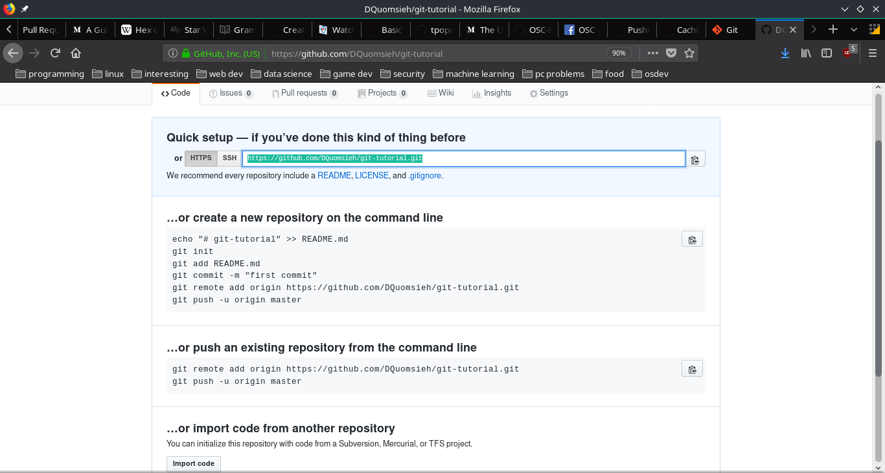

then we do the above command

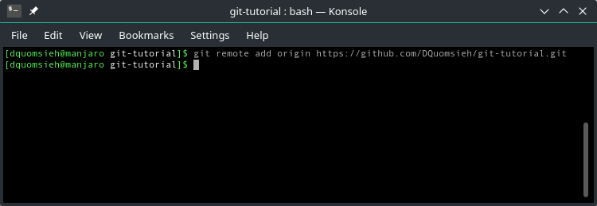

### Step #13: Push local repository to remote repository

```
git push -u <remote repo> <branch name>
```

Here it will ask you for your github username and password

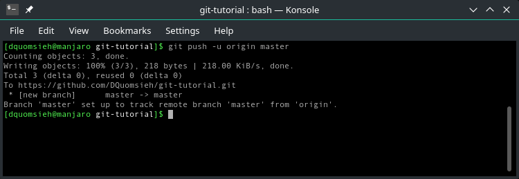


## And thats it! 

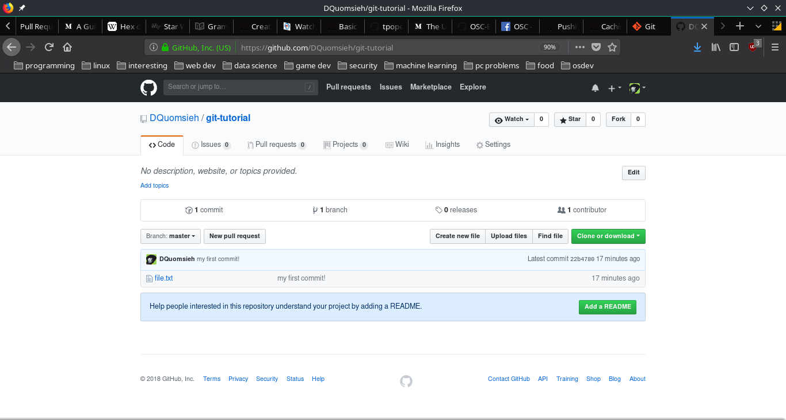