<div align="center">

# Git Tutorial for OSC in Arabic

 

####ÈÑäÇãÌ ÊæÖíÍí ÕÛíÑ á git  Êã ÅÚÏÇÏå áÍÏË á OSC – BZU

</div>

##ÇåÏÇİ ÇáÈÑäÇãÌ 

1.İåã ÇÓÇÓíÇÊ Git .
2.ÇäÔÇÁ local git repository ÈÇ ÓÊÎÏÇã command line  .
3.ÊÍãíá local git repository Úáì ãæŞÚ github .

##ÇáÇæÇãÑ Çáãåãå İí Git 
```
git init
git status
git add <file name> 
git commit -m "your message"
git push -u <remote name> <branch name>
```

##ÇáÎØæÉ ÇáÇæáì : ÊËÈíÊ Git 

Şã ÈÊÍãíá [Git](https://git-scm.com/) ãä ÇáãæŞÚ ÇáÑÓãí .

ÊÃßÏ ãä ÍÕæáß Úáì åĞÇ ÇáÇÎÊíÇÑ , áßä ßá ÔíÁ ÛíÑ åĞÇ íßæä ÇİÊÑÇÖí . 

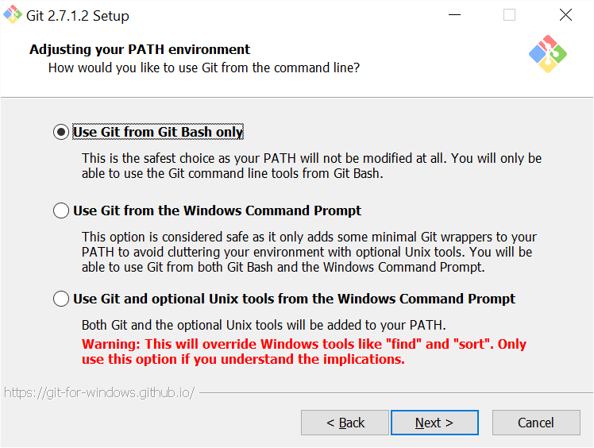

##ÇáÎØæÉ ÇáËÇäíå : ÇäÔÇÁ Ïáíá á ÇáÈÑäÇãÌ 
```
mkdir git-tutorial
cd git-tutorial
```

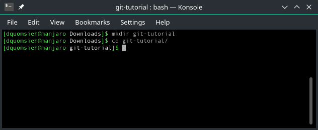

##ÇáÎØæÉ ÇáËÇáËÉ : ÊåíÆÉ git repository 
```
git init
```

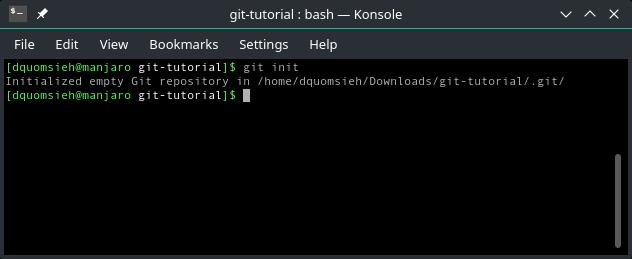


##ÇáÎØæÉ ÇáÑÇÈÚå : ÇáÊÍŞŞ ãä git repository ÇĞÇ ßÇäÊ İÇÑÛå 
```
git status
```


##ÇáÎØæÉ ÇáÎÇãÓÉ : ÇäÔÇÁ ãáİ İÇÑÛ 

```
touch file.txt
ls
```

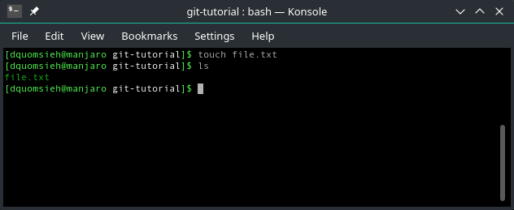


##ÇáÎØæÉ ÇáÓÇÏÓÉ : ÇáÊÃßÏ ãä ÍÇáÉ repository ÚäÏ ÇÖÇİÉ Çáãáİ 

```
git status
```

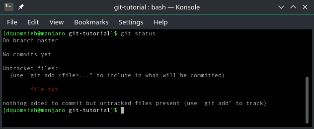

ãáÇÍÙÉ : áÓÇ ÖÇíá ÓÈÚ ÎØæÇÊ ^ ^

##ÇáÎØæÉ ÇáÓÇÈÚÉ : ÇÖÇİÉ Çáãáİ Úáì ÇáãäÕÉ 

```
git add file.txt
```

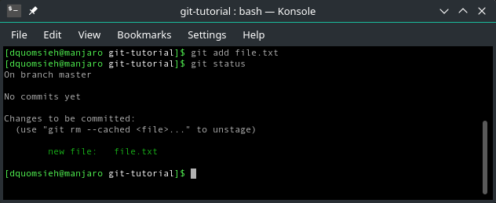

##ÇáÎØæÉ ÇáËÇãäå : ÊåíÆÉ ÇáÇíãíá æ ÇáÇÓã 

```
git config --global user.email "YourEmail@gmail.com"
git config --global user.name "Your Name"
```

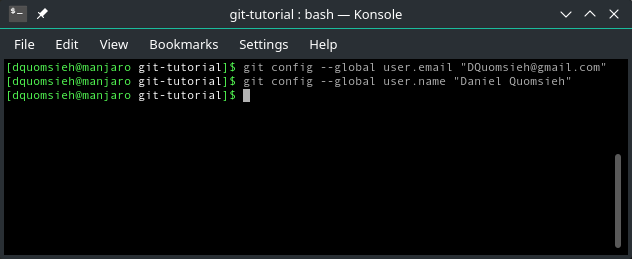

##ÇáÎØæÉ ÇáÊÇÓÚå : ÇäÔÇÁ  a commit 

```
git commit -m "my first commit!"
```

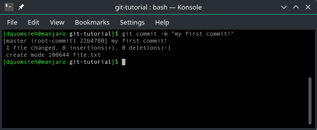


##ÇáÎØæÉ ÇáÚÇÔÑå : ÇáÊÃßÏ ãä ÓÌá  Git 

```
git log
```

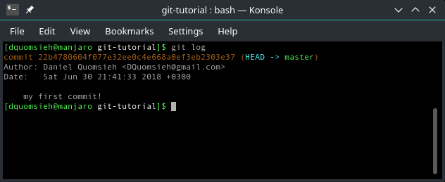

##ÇáÎØæÉ ÇáÍÇÏíå ÚÔÑ : ÇäÔÇÁ ÍÓÇÈ æ repository Úáì github 

ÇäÔÇÁ ÍÓÇÈ Úáì github 

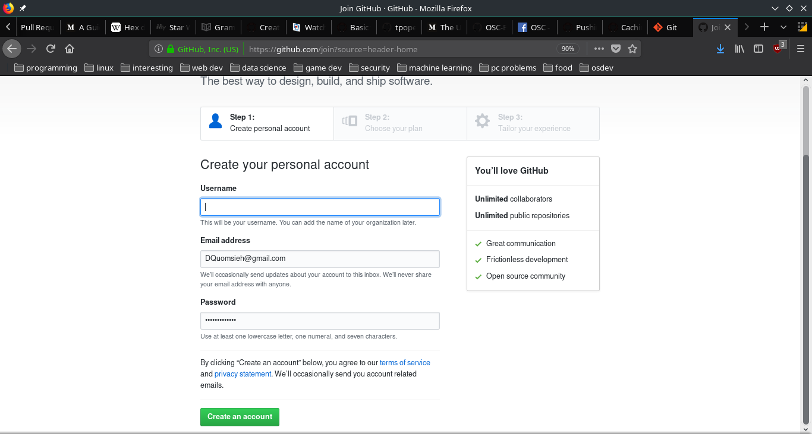

ÈÚÏ Ğáß Şã ÈÇäÔÇÁ repository ÈÇáäŞÑ Úáì ÇÚáì Çáíãíä "+" Ëã "new repository" . 

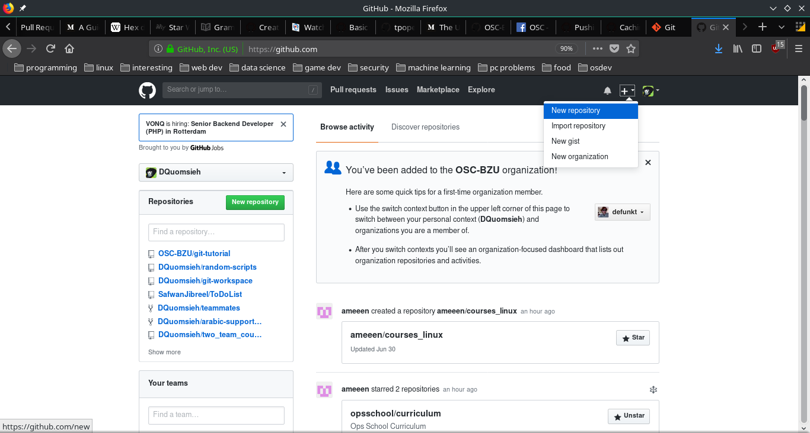

ÈÚÏ Ğáß Şã ÈæÖÚ ÇÓã áå .

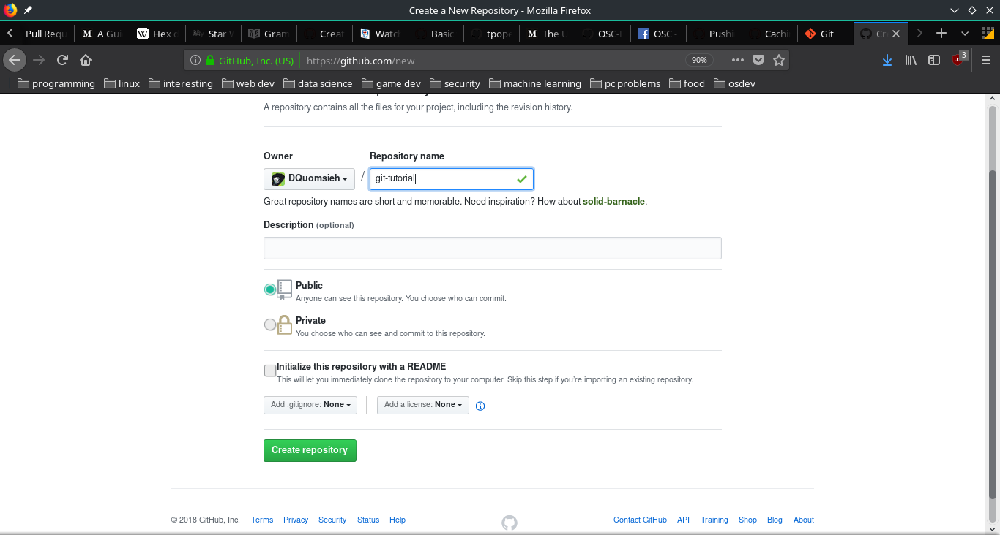

##ÇáÎØæÉ ÇáËÇäíÉ ÚÔÑ : ÇÖÇİÉ ÇáÑÇÈØ Úä ÈÚÏ á local git repository 

```
git remote add origin <link to repo>
```
ÇæáÇ íÌÈ äÓÎ ÇáÑÇÈØ ãä repository ÇáÊí Êã ÇäÔÇÆåÇ İí github 

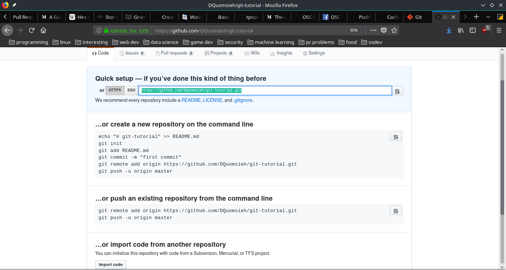

Ëã äŞæã ÈÇáÃãÑ ÃÚáÇå 

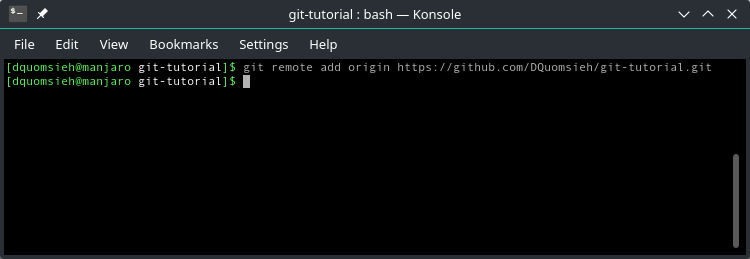 

##ÇáÎØæÉ ÇáÇÎíÑå æ ÇÎíÑÇ : ÑİÚ local repository á    remot repository

```
git push -u <remote repo> <branch name>
```
ÈÚÏ Ğáß Óæİ íŞæã github ÈÓÃáß Úä ÇÓã ÇáãÓÊÎÏã æ ßáãÉ ÇáãÑÑæ , Şã ÈÇÏÎÇáåÇ . 

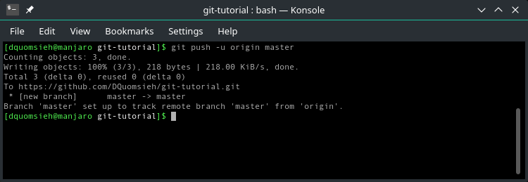 

# æ åÇÖ åæ ^ ^ 

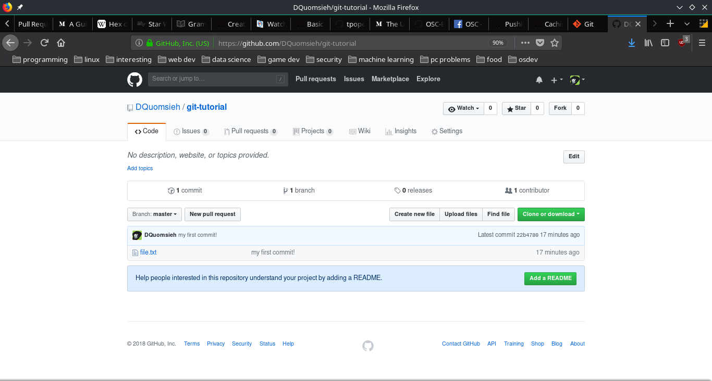

